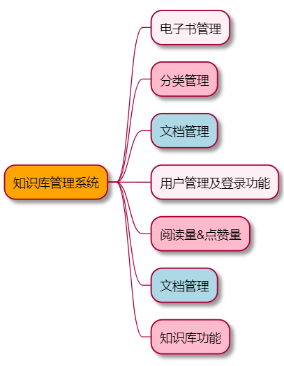

# 项目介绍

前后端分离的知识库管理系统，使用SpringBoot+Vue3进行开发

实现了如图所示功能

# 涉及技术点

| 技术         | Description     |官网|
|------------|-----------------| ------ |
| SpringBoot | 容器+MVC框架 | https://spring.io/projects/spring-boot |
| MyBatis       | ORM框架 | http://www.mybatis.org/mybatis-3/zh/index.html |
| MyBatisGenerator    | 数据层代码生成 | http://www.mybatis.org/generator/index.html |
|Ant Design Vue|    前端UI框架|    https://2x.antdv.com/components/overview-cn/|
|Axios |    前端HTTP框架 |    https://github.com/axios/axios|

# 如何使用

# License
[Apache License 2.0](LICENSE)

Copyright (c) 2019-2022 stanedward1